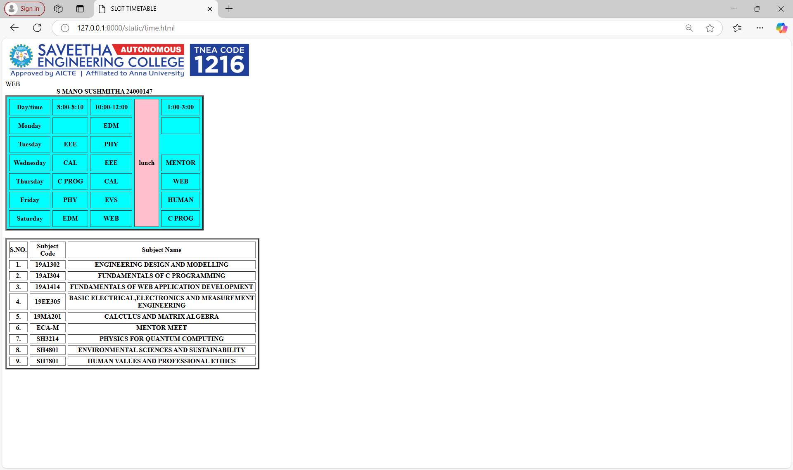

# Ex03 Time Table
## Date:19.11.24

## AIM
To write a html webpage page to display your slot timetable.

## ALGORITHM
### STEP 1
Create a Django-admin Interface.

### STEP 2
Create a static folder and inert HTML code.

### STEP 3
Create a simple table using ```<table>``` tag in html.

### STEP 4
Add header row using ```<th>``` tag.

### STEP 5
Add your timetable using ```<td>``` tag.

### STEP 6
Execute the program using runserver command.

## PROGRAM
```
<!doctype html> 
<html>
    <head>
        <title align="center" >SLOT TIMETABLE</title>
    </head>
    <BODY TEXT="BLACK">
        
        <br>
        <table border= "4" bgcolor="CYAN" cellpadding="10" cellspacing="5" allign="center">
            <caption><b>S MANO SUSHMITHA 24000147</b></caption>
            <tr>
                <th>Day/time</th>
                <th>8:00-8:10</th>
                <th>10:00-12:00</th>
                <th Rowspan="7" bgcolor="pink">lunch</th>
                <th>1:00-3:00</th>
            </tr>
            <tr>
                <th>Monday</th>
                <th></th>
                <th>EDM</th>
                <th></th>
            </tr>
            <tr>
                <th>Tuesday</th>
                <th>EEE</th>
                <th>PHY</th
                <th>WEB</th>
            </tr>
            <tr>
                <th>Wednesday</th>
                <th>CAL</th>
                <th>EEE</th>
                <th>MENTOR</th>
            </tr>
            <tr>
                 <th>Thursday</th>
                <th>C PROG</th>
                <th>CAL</th>
                <th>WEB</th>
            </tr>
            <tr>
             <th>Friday</th>
                <th>PHY</th>
                <th>EVS</th>
                <th>HUMAN</th>
            </tr>
            <tr>
                 <th>Saturday</th>
                <th>EDM</th>
                <th>WEB</th>
                <th>C PROG</th>
            </tr>
        </table>
        </BR>
                <table border="4" cellspacing="5" width="615">
            <tr>
                <th>S.NO.</th>
                <th>Subject Code</th>
                <th>Subject Name</th>
            </tr>
            <tr>
                <th>1.</th>
                <th>19A1302</th>
                <th>ENGINEERING DESIGN AND MODELLING</th>
            </tr>
            <tr>
                <th>2.</th>
                <th>19AI304</th>
                <th>FUNDAMENTALS OF C PROGRAMMING</th>
            </tr>
            <tr>
                <th>3.</th>
                <th>19A1414</th>
                <th>FUNDAMENTALS OF WEB APPLICATION DEVELOPMENT</th>
            </tr>
            <tr>
                <th>4.</th>
                <th>19EE305</th>
                <th>BASIC ELECTRICAL,ELECTRONICS AND MEASUREMENT ENGINEERING</th>
            </tr>
            <tr>
                <th>5.</th>
                <th>19MA201</th>
                <th>CALCULUS AND MATRIX ALGEBRA</th>
            </tr>
            <tr>
                <th>6.</th>
                <th>ECA-M</th>
                <th>MENTOR MEET</th>
            </tr>
            <tr>
                <th>7.</th>
                <th>SH3214</th>
                <th>PHYSICS FOR QUANTUM COMPUTING</th>
            </tr>
            <tr>
                <th>8.</th>
                <th>SH4801</th>
                <th>ENVIRONMENTAL SCIENCES AND SUSTAINABILITY</th>
            </tr>
            <tr>
                <th>9.</th>
                <th>SH7801</th>
                <th>HUMAN VALUES AND PROFESSIONAL ETHICS</th>
            </tr>
        </table>
    </body>
</html>
```

## OUTPUT


## RESULT
The program for creating slot timetable using basic HTML tags is executed successfully.
